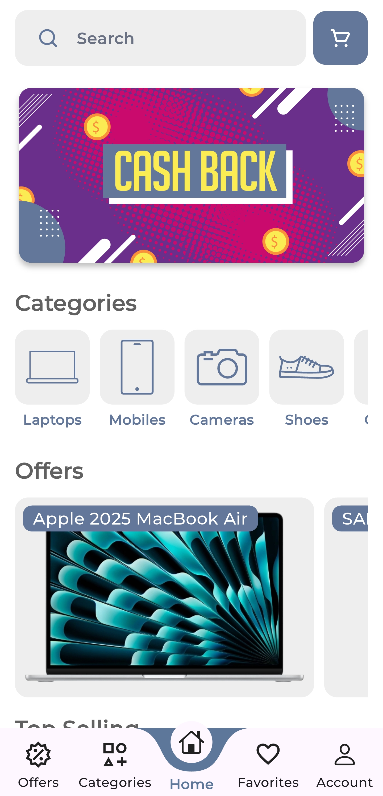

# 🛒 Swift Cart

**Swift Cart** is a complete multi-role e-commerce mobile application built with **Flutter** and **Dart**, featuring a robust **custom backend in PHP** with a **MySQL** database. It delivers an advanced shopping, delivery, and management experience through three separate apps for **users**, **riders**, and **admins**.

---

## 🚀 Features

### 🔐 Authentication (via PHP)
- **Login**, **logout**, **forgot password**, and **reset password** via secure PHP APIs
- **OTP email verification** system powered by PHP mail
- Fully custom authentication logic (no Firebase Auth used)

---

### 👤 User Application
- Browse and **search products**
- **Favorites**, **cart**, and **checkout** system
- Apply **coupons**, explore **offers**, and manage **delivery addresses**
- Place and **track orders live**
- Ability to **cancel orders** when applicable
- **Rate completed orders**
- Receive real-time **notifications** (sent via PHP)
- Full localization: supports **English** and **Arabic**

---

### 🚴 Rider Application
- Browse and **select orders** to deliver (manual assignment)
- Real-time **location tracking** so users can follow rider’s movement
- Order management tools for delivery flow

---

### 🛠️ Admin Application
- Manage and monitor **orders**, **users**, and **riders**
- Add/edit/delete **items** and **product categories**
- Full control over the backend and marketplace structure

---

## 🔎 Search & Explore
- Dynamic **search functionality** across all products
- Rich **product detail pages** with images, pricing, and descriptions

---

### 🎨 Design & Branding
- Modern, clean, and fully **custom UI/UX**
- Branded with a **unique app name and logo**

---

### 🖼️ Screenshots

  
  
  

  
  
  

➡️ [View all screenshots](./screenshots/)

---

## 🧩 Tech Stack

| Layer           | Technology                |
|----------------|----------------------------|
| Frontend       | Flutter & Dart             |
| State Management     | GetX                       |
| Backend        | PHP                        |
| Database       | MySQL                      |
| Auth & Email   | PHP Mail (OTP + auth flows)|
| Notifications  | PHP-based push system      |
| Realtime GPS   | Custom tracking (Rider → User) |

---

## 🙏 Thank You

Thank you for visiting **Swift Cart**!  
I truly appreciate your time and interest in exploring my project.  
If you have any feedback, suggestions, or just want to connect—feel free to reach out.

Stay awesome! 🚀
